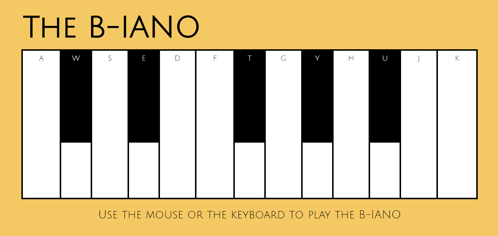

# This is a B-iano.

## It's like a piano but instead uses the sounds of Ben.

###### June 2020

### Things I learnt /experimented with during this project:

- Adding an event listener to the window (keydown) as well as mouseover

- Using a switch statement (with mouseover) and an object (with keydown) to play the audio sounds

- Using CSS Grid to make the b-iano keys and experimenting with the minmax property

- Using a pseudo element to create background opacity

- The audio didn't play until the page was clicked on so I made a pop-up button which had to be pressed in order to 'enter' the page
